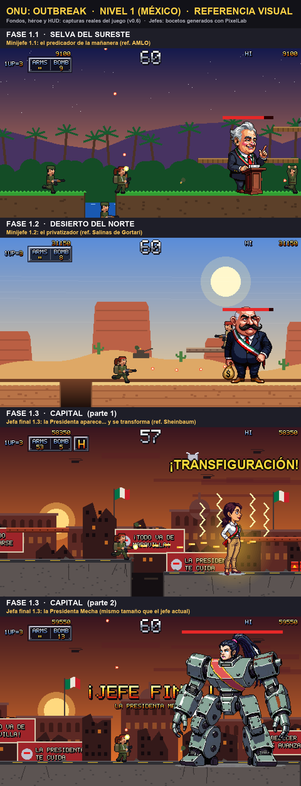

# Historia: ONU: Trying to save the world

Autor: Eduardo (PR #2, 29-09-2026) · Aceptada por Gwyn el 29-09-2026 · Estado: **aceptada; los detalles se van definiendo por partes**

> Parodia política estilo Contra / Metal Slug / Broforce con **caricaturas de políticos reales** (regla cambiada por Gwyn el 28-09-2026). **Tono:** burla tipo Metal Slug, sin gore (derrotas cómicas, sin sangre). Es una reestructura de gran parte del juego y se hará nivel por nivel. Lo marcado con ☐ está por decidir.

## Premisa

Dos héroes intentan salvar el mundo de un apocalipsis político. Una organización secreta, la **Orden Mundial**, reúne a gobernantes de varios países para controlar el planeta. Los héroes viajan a países clave para derrocarlos y evitar la catástrofe.

## Niveles

Cada país tiene 3 fases: dos con minijefe y la tercera con el jefe final del país. Cada jefe tendrá habilidades de combate propias (☐ por definir).

| Nivel | País | Fase 1 | Fase 2 | Fase 3 (jefe final) |
|---|---|---|---|---|
| 1 | Argentina | Sergio Massa | Cristina Kirchner | **Javier Milei** |
| 2 | México | AMLO | Carlos Salinas de Gortari | **Claudia Sheinbaum** |
| 3 | EUA | Joe Biden | Barack Obama | **Donald Trump** |
| 4 | Alemania | Angela Merkel | Olaf Scholz | **Friedrich Merz** |
| 5 | Secreto: reunión de la ONU | Puerta | Puerta | **Líder enmascarado de la Orden Mundial** |

**Nivel 1, Argentina.** Empieza en un pueblo alejado de la capital, donde los héroes se preparan para la lucha. Argentina es el primer país en caer bajo la Orden.

**Nivel 5, secreto.** 3 fases sin minijefes; al final de cada una de las dos primeras hay una puerta. El jefe es el **líder enmascarado de la Orden Mundial**. Al derrotarlo por primera vez aparecen los jefes finales de todos los países, forman un **pentagrama** y se fusionan en el **verdadero jefe final**, con aspecto sci-fi aterrador. Al vencerlo se detiene el apocalipsis.

## Personajes de apoyo

| Rol | Qué hace |
|---|---|
| **Político aliado** | Aparece después de cada jefe final (salvo en el nivel secreto). Mejora el armamento y recarga munición. ☐ ¿Quién es en cada país? |
| **Ayudante religioso** | Da una poción de inmunidad temporal. ☐ ¿Quién es y cuándo aparece? |

## Héroes con skins

- Los **dos héroes** son personajes genéricos pensados para llevar **skins**.
- El jugador podrá **subir su propia skin**, siguiendo unas **reglas de diseño** (☐ tamaño, paleta, animaciones obligatorias), para jugar con su político favorito.
- Idea de **monetización**: cobrar por añadir diseños (p. ej. 1 dólar).

Pendiente de esta parte:
- ☐ ¿Qué pasa con los 4 soldados actuales de ELIGE TU SOLDADO (El Presi, La Tenienta, El Chato, Don Bigotes)? ¿Se quedan como skins de serie?
- ☐ Cómo revisar las skins que suba la gente (desnudos, símbolos de odio, personajes con copyright).
- ☐ Qué permite cada tienda (itch.io, Steam) sobre contenido subido por usuarios, pagos y personas reales.

## Propuesta visual: México (ahora nivel 2)

Eduardo preparó una referencia de México (27-09-2026), cuando aún era el nivel 1. Los fondos, el héroe y el HUD son capturas reales de la v0.6; los jefes son bocetos estáticos de PixelLab ([`propuestas/nivel1/`](propuestas/nivel1/)). Todavía no hay nada en el código.

| Fase | Escenario | Jefe | Idea |
|---|---|---|---|
| 2.1 | Selva del sureste | AMLO, "el predicador de la mañanera" | Pelo cano, cejas marcadas, atril y dedo levantado. |
| 2.2 | Desierto del norte | Salinas de Gortari, "el privatizador" | Calvo, orejas grandes, bigote y bolsa de dinero. |
| 2.3 | Capital | Sheinbaum → **Presidenta Mecha** | A mitad del combate se transfigura en una máquina parecida a ella, del tamaño del jefe mecha actual. |

## Pendiente

- ☐ Fondos distintos por nivel, con detalles interactivos.
- ☐ Diálogos.
- ☐ Diseño de personajes y quiénes son los dos héroes.
- ☐ Habilidades de combate de cada jefe.
- ☐ ¿"Trying to save the world" sustituye a "Outbreak" en el nombre del juego (logo e intro)?
- ☐ Cómo se reaprovechan las misiones actuales (Jungla, Bolivia, Frontera Norte) y sus jefes (Comandante Kruger, Fortaleza Roja, Helicóptero Cóndor) en la nueva estructura.
- ✅ El final chistoso ya aprobado: todos los villanos "reciben su merecido".
